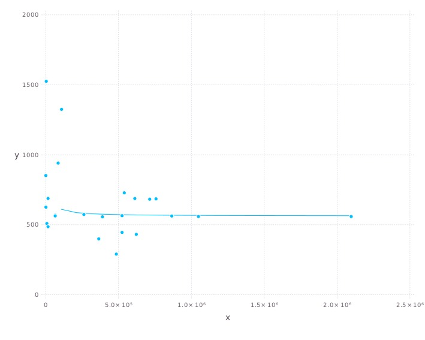

# try SIMD with FixedSizeArrays
Warning: this is work in progress (exploration by @AlainLich)

#### Benchmarking tools
 - improve on <A HREF="../../bench"> original directory </A> by trying
   to eliminate overhead costs, and using simple statistics to eliminate
   noise.
 - calibrate / validate by running the benchmark multiple times and
   doing an analysis against a simplistic model

#### SIMD directive
 - used in order to compare generated code with Julia code possibly
   using libraries

#### Installation
 - in `src/simd` : reusable libraries 
 - in `test/simd`: benchmark specifics (some may move to `src/simd`)

#### Benchmark output
 For now a sample will suffice: 
     
